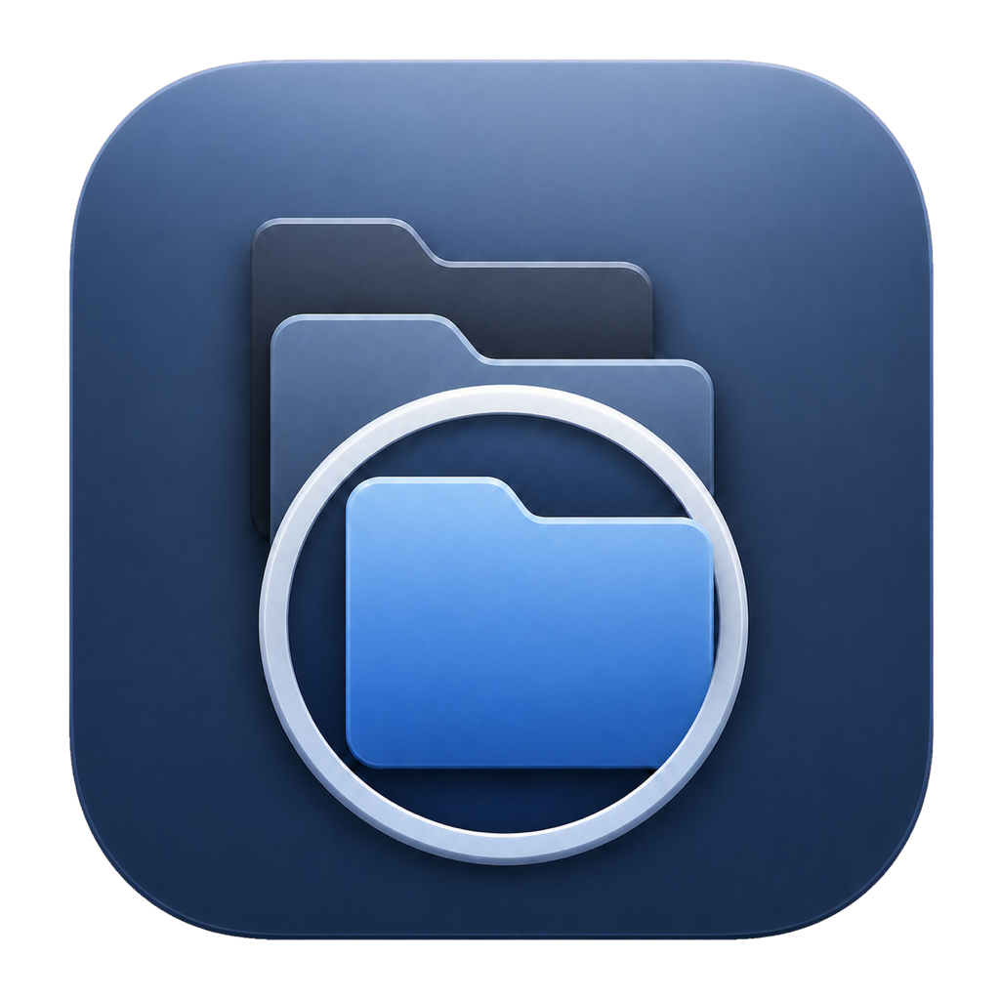

<p align="center">
  
</p>

<h1 align="center">RepoGlance</h1>

<p align="center">
  <strong>Find the right local repo at a glance.</strong><br>
  像 Spotlight 一样搜索本机 Git 项目，预览说明，然后用喜欢的编辑器打开。
</p>

<p align="center">macOS · SwiftUI + AppKit · Local-first</p>

RepoGlance 是一款原生 macOS 菜单栏工具。添加项目目录后，它会自动发现其中的 Git 仓库，并建立保存在本机的搜索索引。

## 功能

- 扫描多个目录，识别普通、嵌套和 worktree Git 仓库
- 搜索项目名称、路径、标签、自定义说明和有限 README 内容
- 悬停查看项目说明或 README 摘要
- 展示仓库父子关系，并支持项目与子树排除
- 使用编辑器、Finder 或终端打开项目
- 支持菜单栏入口、键盘操作和可配置全局快捷键

## 安装

1. 从 [GitHub Releases](https://github.com/nikejaycn/RepoGlance/releases) 下载 DMG。
2. 打开 DMG，将应用拖入“应用程序”文件夹。
3. 如果系统提示无法验证开发者，按住 Control 单击应用并选择“打开”。

## 使用

1. 从菜单栏打开 RepoGlance。
2. 添加一个或多个项目目录。
3. 输入名称、路径、标签或说明搜索项目。
4. 悬停结果查看预览，按 `Enter` 或单击项目打开。

默认全局快捷键为 `⌥ Space`，可以在设置中修改或关闭。

## 从源码构建

需要 Xcode 和 [XcodeGen](https://github.com/yonaskolb/XcodeGen)。

```sh
xcodegen generate
xcodebuild test \
  -project DevSearch.xcodeproj \
  -scheme DevSearch \
  -destination 'platform=macOS' \
  CODE_SIGNING_ALLOWED=NO
```

生成 DMG 和 ZIP：

```sh
zsh scripts/package-local.sh
```

## 隐私

RepoGlance 默认离线运行，不上传项目路径、README、自定义说明或代码内容，也不需要 GitHub、GitLab 或其他远程平台账号。

## 参与贡献

欢迎通过 GitHub Issues 提交问题和功能建议。准备代码改动前，建议先创建 Issue 说明使用场景和预期行为。

## License

仓库尚未添加开源许可证。在提交 `LICENSE` 文件前，默认保留全部权利。
