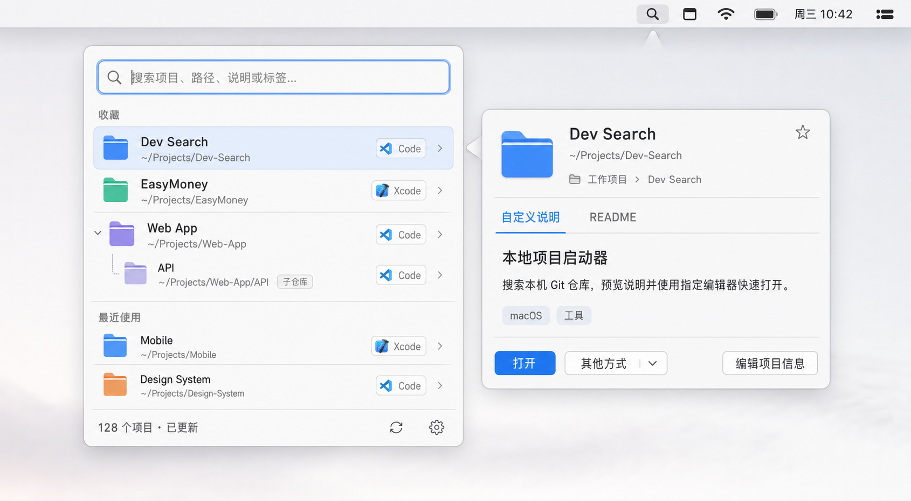
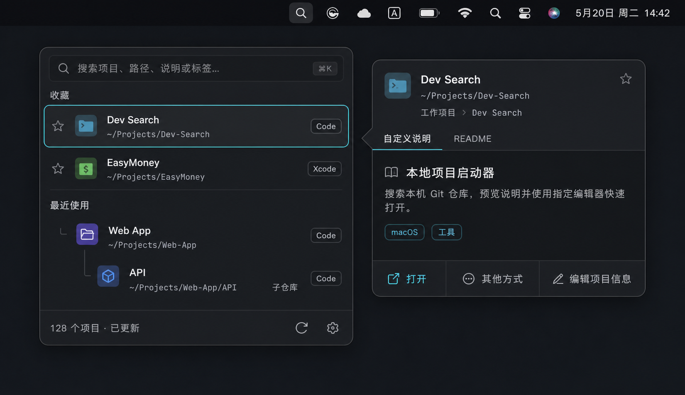
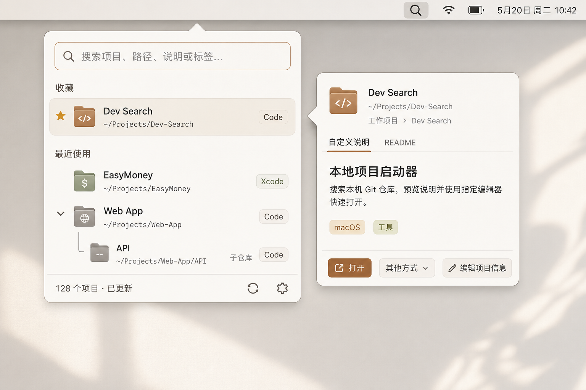

# Dev Search 悬浮界面风格提案

> 生成方式：OpenAI 内置图像生成工具
> 用途：确定产品视觉方向，不作为最终像素级交付稿
> 三版共用同一信息架构，仅比较视觉语言。

## A. 原生克制



定位：接近 macOS 原生工具，轻盈、可信、低学习成本。

- 浅色系统材质、冷灰文字、macOS 蓝色强调。
- 信息密度适中，项目层级清楚。
- 最容易让用户相信它是一个稳定、安静的系统工具。
- 品牌个性相对克制，需要靠图标、动效和细节建立辨识度。

## B. 深色开发者工具



定位：面向重度开发者的高密度工具，像代码编辑器和命令面板的结合。

- 石墨黑和炭灰面板，青色作为焦点色。
- 路径使用等宽字体，开发者氛围最强。
- 父子仓库结构和操作区域最清晰。
- 长时间使用舒适，但如果只提供深色，会降低与浅色 macOS 桌面的融合度。

## C. 温暖编辑台



定位：更有产品性格的个人工作台，强调温和、专注和内容阅读。

- 暖白、石色、陶土橙和少量鼠尾草绿。
- README 阅读区域更像编辑工具，亲和力更强。
- 品牌辨识度最高。
- 对开发者启动器而言略偏生活方式产品，状态色和高密度列表需要谨慎处理。

## 风格对比

| 维度 | A 原生克制 | B 深色开发者 | C 温暖编辑台 |
| --- | --- | --- | --- |
| macOS 融合度 | 很高 | 高 | 中高 |
| 开发者属性 | 中高 | 很高 | 中 |
| 信息扫描效率 | 高 | 很高 | 中高 |
| README 阅读感 | 高 | 中高 | 很高 |
| 品牌辨识度 | 中 | 高 | 很高 |
| 首版实现风险 | 低 | 低 | 中 |
| 适合作为默认主题 | 很适合 | 适合深色模式 | 适合品牌探索 |

## 已确定方向

产品采用 **A 原生克制**，并进一步收敛为 macOS 14+ 的纯系统视觉；在较新系统上自动采用对应版本的原生外观：

1. 使用 SwiftUI/AppKit 原生面板、列表、菜单、设置窗口、材质和 SF Symbols。
2. 名称使用系统字体，路径和仓库元数据使用系统等宽字体。
3. 浅色、深色、强调色、高对比度与减少动态效果均跟随系统，不自建青色或暖色主题。
4. B、C 两版仅作为早期风格探索留档，不进入首期实现。

首期不通过自绘玻璃、品牌色卡或特殊圆角建立辨识度，产品性格来自清楚的父子层级、稳定的悬停预览和符合 macOS 习惯的交互细节。

## 生成 Prompt 集

三版共享约束：

```text
Use case: ui-mockup
Asset type: high-fidelity macOS menu bar utility product UI concept
Primary request: Dev Search macOS 菜单栏工具；左侧为单栏搜索 Popover，右侧为锚定当前结果的独立悬停预览浮层。
Required content: 搜索框；收藏与最近使用；Dev Search、EasyMoney、Web App；嵌套子仓库 API；编辑器标识；项目数量与刷新/设置；预览中的路径、父项目面包屑、自定义说明/README、标签和打开操作。
Exact Chinese UI copy: “搜索项目、路径、说明或标签…”, “收藏”, “最近使用”, “子仓库”, “128 个项目 · 已更新”, “自定义说明”, “README”, “本地项目启动器”, “搜索本机 Git 仓库，预览说明并使用指定编辑器快速打开。”, “打开”, “其他方式”, “编辑项目信息”.
Constraints: practical shippable UI; no fixed split view; nested relationship immediately understandable; legible Chinese; no people, phone, browser chrome, watermark, giant marketing title, or extra copy.
```

A 版风格增量：

```text
Style: native macOS, quiet and precise, light appearance, translucent system materials, crisp realistic UI.
Palette: system white, cool gray, graphite text, restrained macOS blue accent.
Materials: subtle vibrancy blur, hairline dividers, soft panel shadows.
Avoid: colorful gradients, excess glassmorphism, futuristic HUD, oversized cards.
```

B 版风格增量：

```text
Style: dark developer workstation aesthetic, compact command-palette density, professional and native macOS.
Palette: near-black graphite, charcoal, cool slate, off-white, restrained cyan focus accent.
Typography: system sans-serif for names and Chinese; monospaced paths and metadata.
Avoid: neon overload, purple gradients, gaming UI, terminal-only UI, excessive glow.
```

C 版风格增量：

```text
Style: warm editorial productivity tool, calm and crafted, light appearance, subtle paper-like warmth while remaining native macOS.
Palette: warm ivory, stone, taupe, brown-gray text, muted terracotta accent, tiny sage status color.
Materials: matte translucent panels, fine borders, quiet shadow.
Avoid: low contrast, childish illustration, paper-scrap skeuomorphism, loud orange, decorative patterns.
```

## 下一步

确定风格后，下一轮不再生成完整概念图，而是围绕选定方向细化：

1. 主面板正常态。
2. 搜索结果态。
3. 悬停预览的自定义说明、README 和空内容态。
4. 子仓库、路径失效和扫描中状态。
5. 浅色与深色的统一组件规范。
