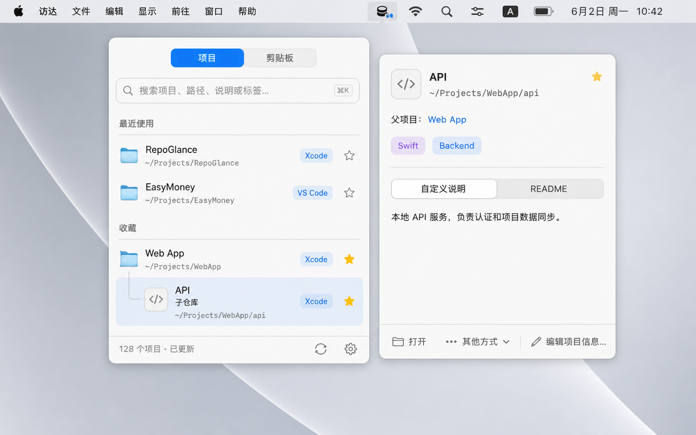
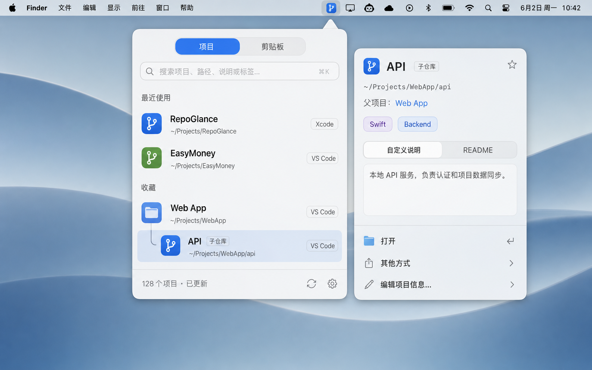
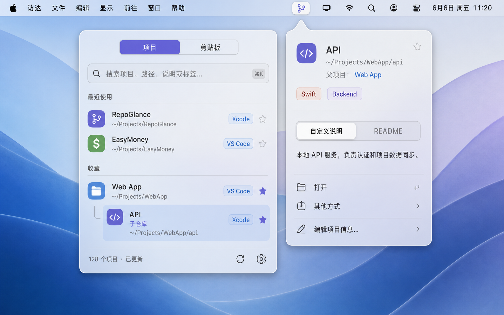
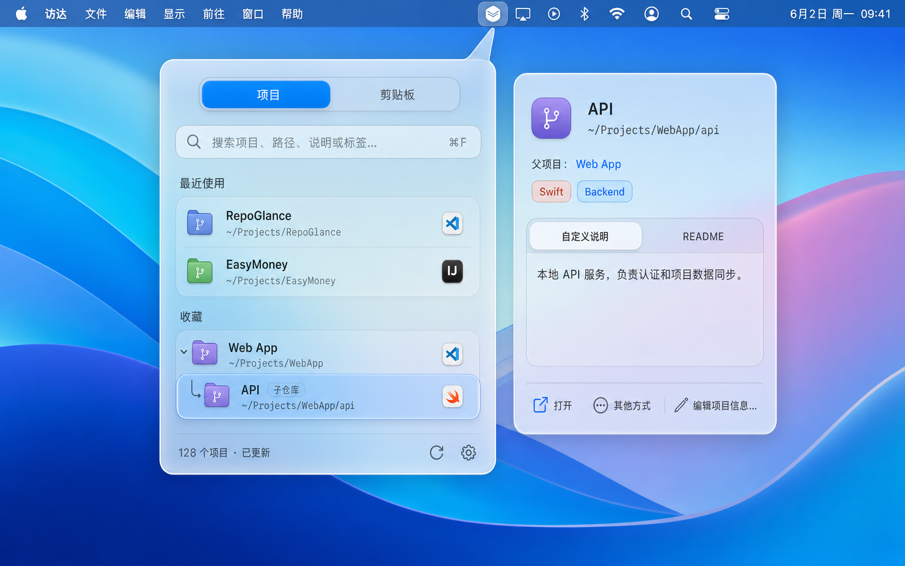
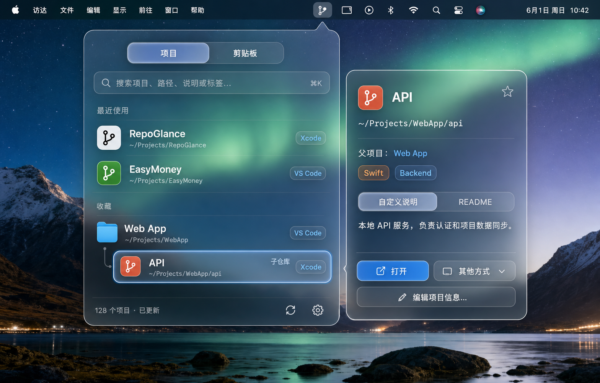

# RepoGlance UI 方向探索

> 生成方式：OpenAI 内置图像生成工具
> 用途：比较视觉方向，不作为像素级实现稿
> 共同结构：菜单栏入口、项目搜索主面板、嵌套仓库层级、独立悬停预览浮层

## 已确认方向

采用 **02 · Refined System**。

- 最新 HIG 修订版：[`refined-system-hig-pages/README.md`](./refined-system-hig-pages/README.md)
- 初版完整页面：[`refined-system-pages/README.md`](./refined-system-pages/README.md)

五份设计稿使用相同的信息结构，透明程度从低到高递进。选择时应重点观察面板材质、信息密度、桌面融合度和文字可读性，不必把生成图中的图标细节视为最终方案。

## 01 · Native Utility

最接近标准 AppKit / SwiftUI 的原生工具：

- 主要使用不透明系统表面，仅在局部保留轻微材质感。
- 层级、分隔线和列表密度最保守，学习成本最低。
- 与当前实现的距离最短，兼容性和实现风险最低。
- 产品辨识度主要依靠图标、层级交互和动效。

## 02 · Refined System

在原生基础上增加一层精致感：

- 类似 Spotlight 与 Finder 检查器的轻透系统材质。
- 菜单栏锚点、选中态和浮层关系更清楚。
- 保留高可读性，同时比纯原生方案更有产品感。
- 很适合作为“原生优先，但不完全默认控件化”的方向。

## 03 · Soft Frost

原生与透明之间的平衡方案：

- 中等透明度和可控背景模糊，桌面颜色会进入界面。
- 半透明选中态与紫蓝强调色带来更明确的视觉识别。
- 仍能保持列表扫描效率和正文可读性。
- 需要针对浅色、深色和复杂壁纸校验对比度。

## 04 · Liquid Glass

偏 macOS 26 Liquid Glass 的现代方案：

- 更明显的边缘折射、高光和光学层次。
- 控件与选中行拥有浮起的玻璃胶囊感。
- 品牌感和新系统特征更强。
- 需要控制玻璃层级，避免每一行都变成独立卡片。

## 05 · Spatial Clear

透明度最高的实验性方案：

- 桌面背景深度参与界面构图，面板边界主要依赖玻璃描边。
- 视觉最轻、最具空间感，也最容易形成独特印象。
- 对壁纸、辅助功能、高对比度和降低透明度设置最敏感。
- 若采用，应为文字区和操作区设计自适应可读性衬底。

## 横向比较

| 方向 | 原生融合 | 透明感 | 信息扫描 | 品牌辨识 | 实现风险 |
| --- | --- | --- | --- | --- | --- |
| 01 Native Utility | 很高 | 低 | 很高 | 中低 | 低 |
| 02 Refined System | 很高 | 中低 | 很高 | 中 | 低 |
| 03 Soft Frost | 高 | 中 | 高 | 中高 | 中 |
| 04 Liquid Glass | 高 | 高 | 中高 | 高 | 中高 |
| 05 Spatial Clear | 中高 | 很高 | 中 | 很高 | 高 |

## 选择建议

- 选择 **01**：优先稳定、克制和最低实现成本。
- 选择 **02**：希望原生可信，同时比系统默认控件更精致。
- 选择 **03**：希望在可读性、现代感和透明度之间取得平衡。
- 选择 **04**：希望明显拥抱 macOS 26 的 Liquid Glass 视觉。
- 选择 **05**：希望建立最鲜明的透明空间风格，并接受更高适配成本。

确定方向后，再基于选中稿制作可实现的组件规范、浅深色状态、悬停状态和异常状态，不直接照搬生成图中的图标与尺寸。
